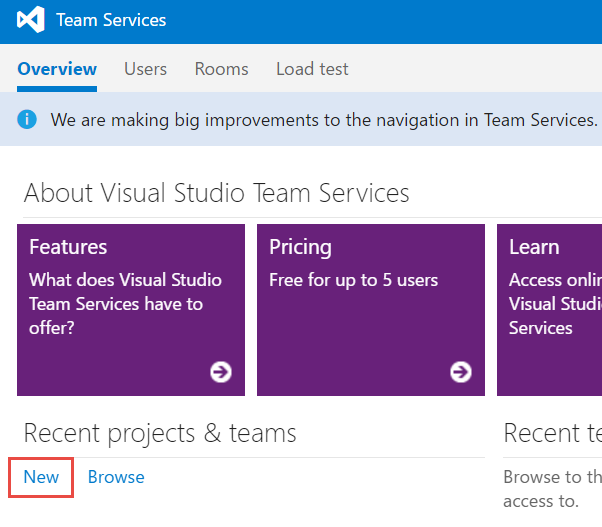
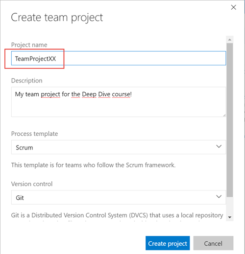
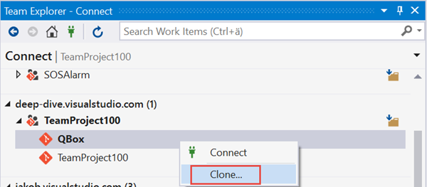
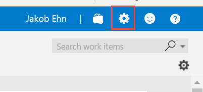
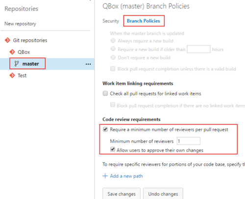
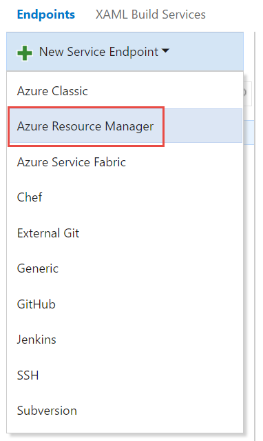
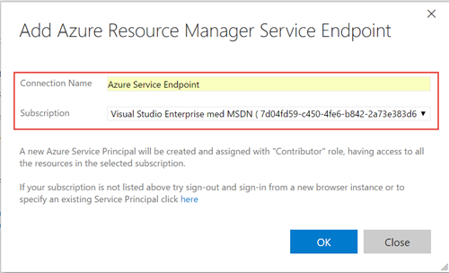

# Exercise 0 - Setup

In this lab you will setup your environment to prepare for the rest of the excercises.
You will:
* Create a new Team Project
* Import the QuizBox source code repository from GitHub
* Clone the project in Visual Studio
* Setup a branching policy that requires pull requests to be used
* Create an Azure Service Endpoint that will allow you to easily create and update resources in Azure from your build and release definitions later on.

Expected time for this exercise: 15 minutes.

## Creating a team project

1. Open a web browser and browse to https://deep-dive.visualstudio.com/

2. Login using your assigned user login and password
 
3. Click on the *New* link to create a new team project

    

4. For the name of the team project, enter *TeamProject* + your assigned team id, for example *TeamProject03*. Select *Scrum* as the Process template and make sure that *Git* is used for Version control.

    
 
5. Click create and wait for the project to be created


## Importing the sample project

4. After the project has been created, go to the *Code* hub group

5. From the repository selector drop-down, click *Import repository*

    

6. In the *Clone URL* field, enter the following URL:

```
https://github.com/solidifysv/QBox.git

``` 

7. Click *Import* to import the QBox repository into a new Git repo in your team project

## Cloning the project in Visual Studio

1. Start Visual Studio and open the Team Explorer window (*View -> Team Explorer*)

2. Press the *Manage Connections* button, and the select *Manage Connections -> Connect to Team Project*

    

3. Click on  *Servers...* and then *Add* to add a connection to the deep-dive project

    
    
4. Log in using your supplied credentials

5. Once connected, select your team project from the list of team projects

6. Clone the project by browsing to the QBox repository that is located beneath your team project in the Connect page:

    
    
7. Accept the default local path (which should be *%HOMEPATH%\source\repos\QBox*) and select *Clone*

    
    
## Creating a Branch Policy

1. Go back to the Visual Studio Team Services team project page

9. Click on the *Team Settings* wheel at the top right

    

10. Select the *Version Control* tab and select the QBox repository

11. Select the *master* branch and then click on the *Branch policies* section

12. Select the *Require a minimum number of reviewers per pull request* checkbox

13. Set the minimum number of reviewers to 1 and check the *Allow users to approve their own changes*

    

14. Save the branch policy. 

15. Verify that the policy is working by trying to commit and push something to the master branch, either from Visual Studio or straight from VSTS. 
You should receive an error message stating that you must submit your changes using a pull request.

16. Finally, we will create an Azure Service Endpoint. Go back to the Team Settings page and select the *Services* tab

17. Select *New Service Endpoint* and select 

    
    
18. Enter *Azure Service Endpoint* as the connection name, and select the subscription that should be available in the dropdown below

    
    
19. Press *OK* and wait for the endpoint to be created.


 
