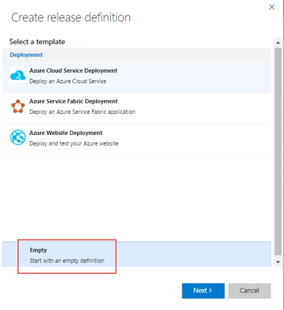
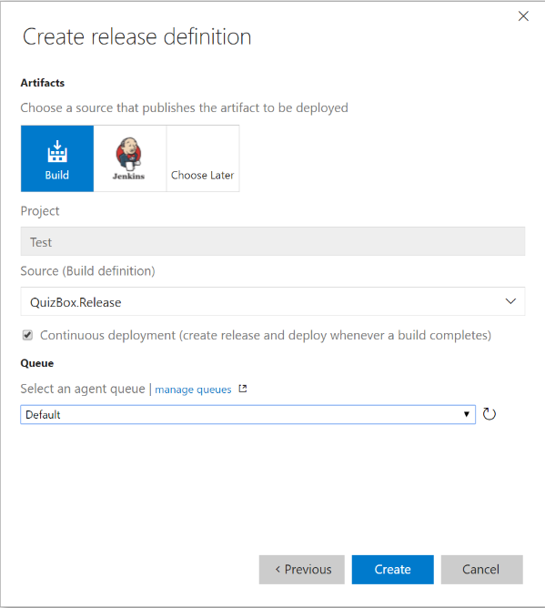
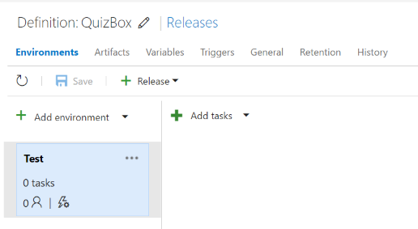
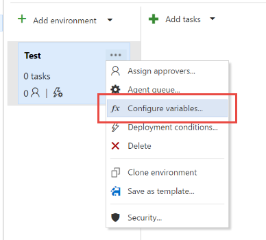
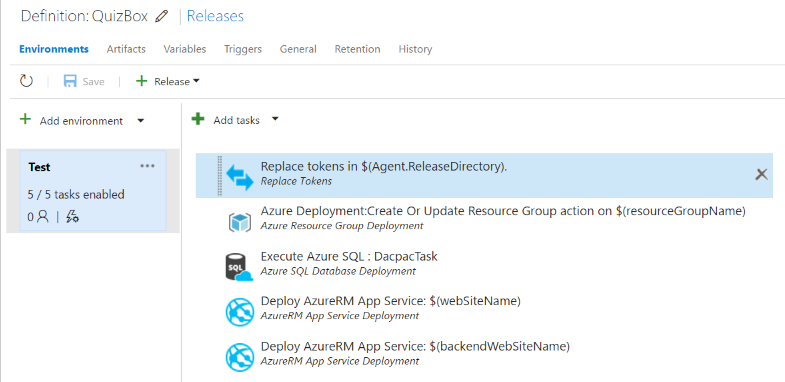
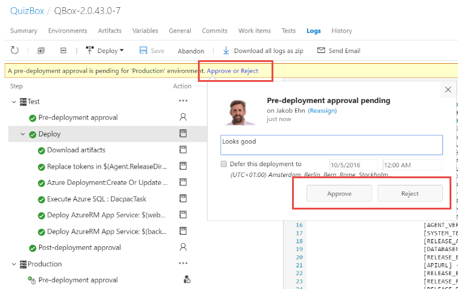

# Exercise 2 - Release Management

**TODO**: 
* Add images
* Add further ideas

## Learnings
1. Creating a release pipeline for deploying your application to multiple environments

2. Understand how to manage configuration across environments

3. How to queue and track a release

## Setup / prerequisites
Before starting on this excercise, you need to complete the previous excercise in which you created a release build definition. 
This build definition produces versioned artefacts that we will use in this excercise.

## Azure Service Endpoint
All build and deployment tasks that communicate with an Azure subscription does so using an Service Endpoint. 
A service endpoint wraps all the information necessary in order to communicate with an external system (such as Azure, Jenkins or GitHub) so that 
this does not have to be done for each release definition. Also, it makes it possible to keep sensitive information such as passwords stored in one place.

In this lab, you will use an *Azure Resource Manager Service Endpoint* which has already been configured for you.
The name of the service endpoint is *Azure Service Endpoint* 
 

## Creating a Release Definition
In Visual Studio Release Management, a deployment pipeline is implemented by creating a release definition. 
The definition contains information about the different environments, how the application should be deployed to each environment and which users should (if necessary) verify the deployments

1. Go to the Release hub

2. Click the *New Definition* button

3. Note that there are several different templates that can be used for certain scenarios. In this excercise, we will start from scratch so click on *Empty* at the bottom

    

4. Click *Next*, then select the build definition that you created in the previous excercise.

5. Check the *Continuous deployment...* checkbox to automatically deploy the application every time a release build finishes

6. Select the agent queue that you created when installing the build agent

    

7. Press *Create*. 

8. Rename the empty environment to *Test*

9. Go to the General tab and change the *Release name format* to *QBox-$(Build.BuildNumber)-$(rev:r)*

9. Press *Save* and name the release definition *QuizBox*

    

## Configure the test environment
Now we need to define the configuration variables for this release definition. 
Configuration variables contain the settings that either differ between the different environment, or for values that should be reused across multiple environments. 

1. First, let's create a release variable that will contain the unique id for you/your team. This variable is then used in subsequent variables

2. Go to the Variables tab and add a new variable called *TeamId* and give it the value (two digits) that you have been assigned:

    
 
3. Click the context menu for the Test environment(The ...) and select *Configure variables*

2. Add all the variables listed below (**Note the Secret variable**)

3. Save the release definition

| Variable        | Value           | Secret |
| ------------- |-------------||
| **apiUrl:**      | http://quizboxtestapi$(teamId).azurewebsites.net/api ||
| **databaseLogin:**      | quizboxadmin ||
| **databasePassword:**      | P2ssw0rd | Yes |
| **resourceGroupName:**      | quizboxtest ||
| **resourceGroupLocation:**      | North Europe ||
| **hostingPlanName:**      | quizboxtest ||
| **databaseName:**      | quizbox ||
| **databaseServerName:**      | quizboxtest$(teamId) ||
| **databaseServer:**      | $(databaseServerName).database.windows.net ||
| **webSiteName:**      | quizboxtest$(teamId) ||
| **backendWebSiteName:**      | quizboxtestapi$(teamId) ||

## Add deployment tasks 
Now it's time to specify how the deployment steps for QuizBox. We will be using an ARM (Azure Resource Manager) template for creating the environment. In this case, the template will contain 2 web sites, one SQL server and a SQL database. Then we will use a couple of deployment tasks to deploy the web sites and the database.*

1. Select the Test environment

2. Select *Add tasks*

3. Add a *Replace Tokens* task (in the Utility section)

4. Enter the following variables:

| Variable        | Value           |
| ------------- |-------------|
| **Source Path:**      | $(Agent.ReleaseDirectory)|
| **Target File Pattern:**      | \*\*\\\*.SetParameters.xml|

5.  Add an *Azure Resource Group Deployment* task (in the Deploy category)

6. Set the following variables

| Variable        | Value           |
| ------------- |-------------|
| **Azure Connection Type:**      | Azure Resource Manager|
| **Azure RM Subscription:**      | Azure Service Endpoint |
| **Action:**      | Create or Update Resource Group|
| **Resource Group:**      | $(resourceGroupName) |
| **Location:**      | $(resourceGroupLocation)|
| **Template:**      | $(System.DefaultWorkingDirectory)/QBox.Release/ARMTemplate/WebSiteSQLDatabase.json|
| **Template Parameters:**      | $(System.DefaultWorkingDirectory)/QBox.Release/ARMTemplate/WebSiteSQLDatabase.parameters.json|
| **Override Template Parameters:**      | -administratorLoginPassword (ConvertTo-SecureString -String '$(databasePassword)' -AsPlainText -Force) -administratorLogin $(databaseLogin) -hostingPlanName $(hostingPlanName) -databaseName $(databaseName) -webSiteName $(webSiteName) -databaseServer $(databaseServerName) -backendWebSiteName $(backendWebSiteName)
|

7. Add an *Azure SQL Database Deployment* task (in the Deploy category)

8. Set the following variables:

| Variable        | Value           |
| ------------- |-------------|
| **Azure Connection Type:**      | Azure Resource Manager|
| **Azure RM Subscription:**      | Azure Service Endpoint|
| **Azure SQL Server Name:**      | $(databaseServer)|
| **Database Name:**      | $(databaseName)|
| **Server Admin Login:**      | $(databaseLogin)|
| **Password:**      | $(databasePassword)|
| **Type:**      | SQL DACPAC File|
| **DACPAC File:**      | $(System.DefaultWorkingDirectory)/QBox.Release/database/QuizBoxDB.dacpac|
| **Specify Firwall Rules Using:**      | AutoDetect |

9. Add an *AzureRM App Service Deployment* task (in the Deploy category

10. Set the following variables

| Variable        | Value           |
| ------------- |-------------|
| **Azure RM Subscription:**      | Azure Service Endpoint|
| **App Service Name:**      | $(webSiteName) |
| **Package or Folder:**      | $(System.DefaultWorkingDirectory)/QBox.Release/frontend/QBox.Web.zip |
| **Publish using Web Deploy:**      | Checked |
| **SetParameters File:**      | $(System.DefaultWorkingDirectory)/QBox.Release/frontend/QBox.Web.SetParameters.xml |

11. Add another *AzureRM App Service Deployment* task (in the Deploy category

12. Set the following variables

| Variable        | Value           |
| ------------- |-------------|
| **Azure RM Subscription:**      | Azure Service Endpoint|
| **App Service Name:**      | $(backendWebSiteName) |
| **Package or Folder:**      | $(System.DefaultWorkingDirectory)/QBox.Release/backend/QBox.Api.zip |
| **Publish using Web Deploy:**      | Checked |
| **SetParameters File:**      | $(System.DefaultWorkingDirectory)/QBox.Release/backend/QBox.Api.SetParameters.xml |

13. Your release definition should now look like this:

    

14. Save the release definition

## Create Production environment
Now that the Test environment is configured, we need to add the production environment. 
The deployment steps should be identical to the Test environment, we only need to specify different configuration values.
Therefor, we can quickly create the production environment by cloning the Test environment.
This will copy all the settings, and then we can just change the production values.

1. Click on the context menu for the *Test* environment and select *Clone environment".

2. In the Pre-deployment approval select *Specific users* and browse to your own account

3. In the Queue section, make sure that the agent queue you created earlier is selected

4. Click *Create*

5. Rename the new environment to *Production*

6. Click on the context menu for the *Production* environment and select *Configure variables*

7. Set the following variables: 

| Variable        | Value           | Secured |
| ------------- |-------------||
| **apiUrl:**      | http://quizboxprodapi$(teamId).azurewebsites.net/api ||
| **databaseLogin:**      | quizboxadmin ||
| **databasePassword:**      | P2ssw0rd | Yes |
| **resourceGroupName:**      | quizboxprod ||
| **resourceGroupLocation:**      | North Europe ||
| **hostingPlanName:**      | quizboxprod ||
| **databaseName:**      | quizbox ||
| **databaseServerName:**      | quizboxprod$(teamId) ||
| **databaseServer:**      | $(databaseServerName).database.windows.net ||
| **webSiteName:**      | quizboxprod$(teamId) ||
| **backendWebSiteName:**      | quizboxprodapi$(teamId) ||

8. Save the release definition

## Trigger a release
Let's try out our release definition.We do this by committig a change to the QuizBox repo.

1. Commit a change to the QuizBox repository. Associate the commit to a work item.

2. Wait for the Quizbox.Release build to complete. This should automatically trigger a release.

3. Open the running release and select the *Logs* tab on the running release to see the progress and the log output

4. In the *Commits* tab you should see the commit that is being released. By default, it shows the commit(s) compared to the last relase that was deployed

5. In the *Work Items* tab, you should see the work items that were associated with the commits. This can form the basis for release notes

6. After the release has been deployed to the *Test* environment, the release should stop and wait for your approval

7. Verify that the application has been deployed to the Test environment and is working as expected.  
   You can do this by browsing to *https://quizboxtest0$(teamId).azurewebsites.net/*
   
8. Approve the release by clickin the Approve link at the top of the summary page

    

9. Verify that the release is deployed to the production environment as expected

## Further ideas
* To avoid repeating the same set of steps in every environment, it is possible to create *Task Groups*.
  A Task Group is a set of tasks that can have it's own set of input and output, and can be reused across multiple release definitions
  
* Releases can be deployed in parallell across multiple environments. Try changing the release definition so that the release is deployed to the Test and Production simultaneously

* Releases can contain a Manual Intervention step, to allow for manual steps. Try adding this and see how this affect the release process
  Tip: The Manual Intervention task is executed in a so called *Server phase*, click in the icon next to the *Add tasks* button to select this

