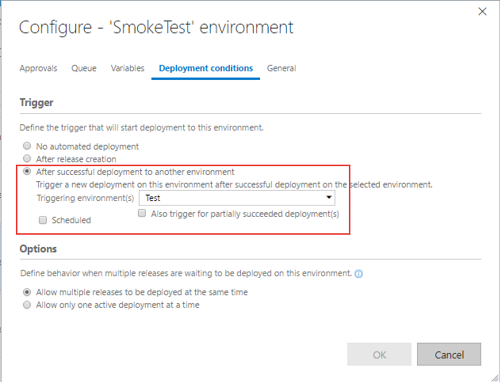
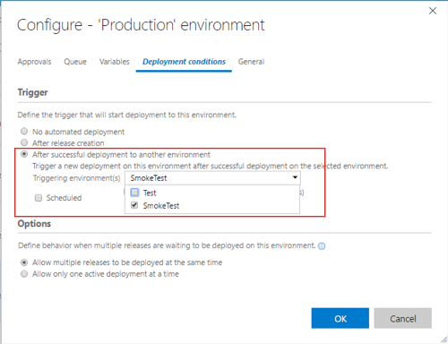
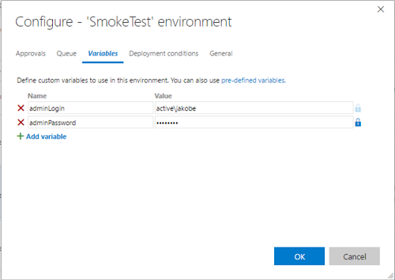
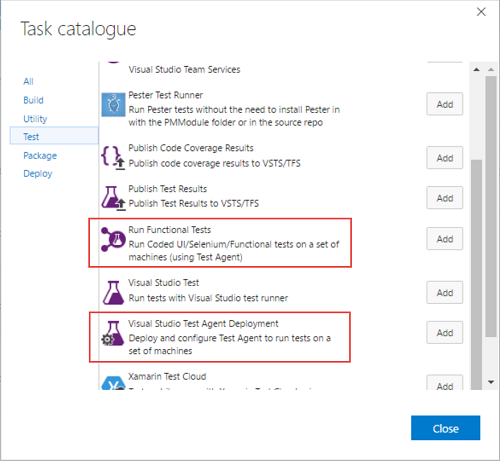
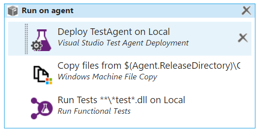
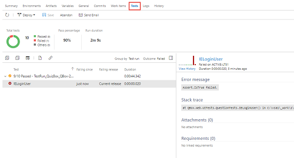
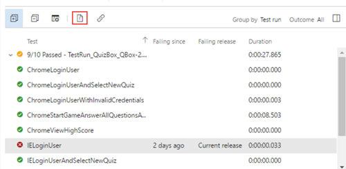

# Exercise 3 - Running Functional Tests

## Learnings
1. How to run functional UI tests during a release pipeline

2. Doing test run analysis, tracking down failed tests

## Setup / prerequisites
In this lab, your local machine will be used as a test agent in interactive mode to run functional, browser based UI tests.
Normally the tests wouldbe executed from one or more dedicated test servers, but to keep the lab setup simpler we will run everything on the local machine.

### Enable PowerShell Remoting
The task for deploying a test agent and run functional tests on remote machines rely on PowerShell remoting. 
PS Remoting uses Windows Remote Management (WinRM) protocol, and it needs to be enabled on machines before trying to connect to it using PS Remoting.

1. Open a PowerShell command prompt in *Admin* mode

2. Run

    ```
    Enable-PSRemoting
    ```

3. If the command gives you the following error

   ```
    Message = WinRM firewall exception will not work since one of the network connection types on this machine is set to Public. Change the network connection type to either Domain or Private and try again.
   ```
   
   Try running 

    ```
    Enable-PSRemoting -SkipNetworkProfileCheck -Force
    ```
    
4. Verify that you can connect to your local machine using Remote PowerShell
 
    ```
    enter-pssession -ComputerName 127.0.0.1
    
    [127.0.0.1]: PS C:\Users\jakobe\Documents>
    ```
 
### Prerequisites
The UI tests that are included in the sample application QuizBox uses Selenium WebDriver to run the tests on **Chrome** and **Internet Explorer**.
To have the tests run successfully, you need to have both these browsers installed. If this is not possible, you need to comment out the corresponding tests.
  
    
 
## Adding Functional Tests to the Release Definition

In this lab, we will add functional testing to our release pipeline. In this case, the tests are implemented using Selenium WebDriver, and they are executed both for Chrome and Internet Explorer.
 
We want to run the tests after we have deployed the application to the test environment. We could either add some more steps to the existing *Test* environemnt, or we can create a new environment that is dedicated to running tests, and is executed after the *Test* environment
We will go with the later solutoin, since this also let's us rerun the test easily without reploying the application under test.
 
1. Create an new environment and call it *SmokeTest*
 
2. Change the Deployment conditions so that the *SmokeTest* environment is triggered after the *Test* environment has completed succesfully

    
 
3. Change the Deployment condition of the *Production* environment so that is is triggered after the *SmokeTest* environment

    
   
4. Select the *SmokeTest* environment, and browse to the *Variables* tab

5. In order to deploy a test agent we will need to specify a set of credentials. Note that these credentials must have admin rights on your machine.
   Since we want to handle passwords securely, we create two variables for containing the values:

| Variable        | Value           | Secured |
| ------------- |-------------|-------------|
| **adminLogin:**      | *accountWithAdminPriviledges* ||
| **adminPassword:**      | *password* | Yes|  
   
     

6. Add an instance of the *Visual Studio Test Agent Deployment* task

    
    
7.   Set the following variables

| Variable        | Value           |
| ------------- |-------------|
| **Machines:**      | 127.0.0.1 |
| **Admin Login:**      | $(adminLogin) |
| **Admin Password:**      | $(adminPassword) |
| **Protocol:**      | HTTP |
| **User Name:**      | $(adminLogin) |
| **Password:**      | $(adminPassword) |
| **Interactive Process:**      | Checked |
| **Update Test Agent:**      | NOT Checked |

8. Add an instance of the *Run Functional Tests* task

9. Set the following variables

| Variable        | Value           |
| ------------- |-------------|
| **Test Selection:**      | Test Assembly |
| **Test Assembly:**      | **\*test*.dll |
| **Run Settings File:**      | QBox.Release\uitests\default.runsettings |
| **Override Test Run Parameters:**      | webAppUrl=https://quizboxtest$(teamId).azurewebsites.net |

    
    
10. Save the release definition

## Running och Tracking Test 

1. To run the test, queue a new release

```
The first time the deploy test agent tasks is executed, it will install the test agent on your machine.
This will take some extra time, and in some cases it will cause the machine to reboot. 
Since we are running the relesae agent on the same machine, the build will obviosuly fail.
If this happens, requeue the release after the machine has rebooted  
```
2. When the tests start running, you should see a console window (*DTAExecutionHost*) pop up and after a while the tests starts to exeecute.

  **Note:** Don't use the mouse or keyboard during the test run, as this can cause the tests to fail

3. When the test complete, the release finish and you can view the test results 

4. You should see that the *SmokeTest* step failed, the reason for this is that one of the tests is failing 

5. Go to the *Tests* tab to analyze the test results. You will see an overall summary of the test results, and in the list the test that is failing should be listed:
    
    

6. Note that you get detailed information about the failing tests, as well as the history for this particular test. You can also change the *Outcome* filter to view the other tests as well 

7. Select the failed test and click on the *Create bug* button in the toolbar above. The bug will contain the detailed information about the failed test(s) and links to the corresponding build.

     

8. Go back to Visual Studio,  locate the failing test and fix the error(that should be rather easy :-) ) 

9. Commit the fix and associate to the bug work item that you just created

8. Push the changes and wait for the build and release to complete, it should now complete without any error


## Further ideas

1. **Machine Groups**  
   Instead of hardcoding the server information in the tasks like we did above, create a *Machine Group* that encapsulates this information. You find this under the *Test* tab. Create a machine group called QuizBoxTEST and add your local machine to it together with the credentials. In the deployment steps, replace the 127.0.0.1 with the name of the machine group, and remove the credentials (since these are configured in the machine group).  
   Note that you need to specify port *5985* for the machine in the machine group, since this is the port used for HTTP access
   
2. 
